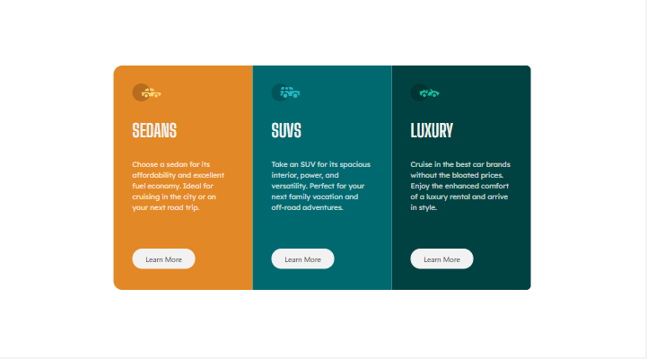
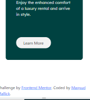

# Frontend Mentor - 3-column preview card component solution

This is a solution to the [3-column preview card component challenge on Frontend Mentor](https://www.frontendmentor.io/challenges/3column-preview-card-component-pH92eAR2-). Frontend Mentor challenges help you improve your coding skills by building realistic projects.

## Table of contents

- [Overview](#overview)
  - [The challenge](#the-challenge)
  - [Screenshot](#screenshot)
  - [Links](#links)
- [My process](#my-process)
  - [Built with](#built-with)
  - [What I learned](#what-i-learned)
  - [Continued development](#continued-development)
  - [Useful resources](#useful-resources)
- [Author](#author)
- [Acknowledgments](#acknowledgments)

**Note: Delete this note and update the table of contents based on what sections you keep.**

## Overview

### The challenge

Users should be able to:

- View the optimal layout depending on their device's screen size
- See hover states for interactive elements

### Screenshot
Desktop view:

Mobile View:

:

### Links

- Solution URL: (https://github.com/MaqsudMallick/3-card-responsive
- Live Site URL: (https://maqsudmallick.github.io/3-card-responsive/)

## My process

### Built with

- Semantic HTML5 markup
- CSS custom properties
- Flexbox
- CSS Grid
- Mobile-first workflow

### What I learned

- the CSS grid classes of bootstrap does not work properly when a fixed length of the row class is set up. The Cols that were supposed to be responsive are forever stuck in a the given length of the row losing the responsiveness.

### Useful resources

- GIMP Image Editor

## Author

- Frontend Mentor - [@yourusername](https://www.frontendmentor.io/profile/yourusername)
